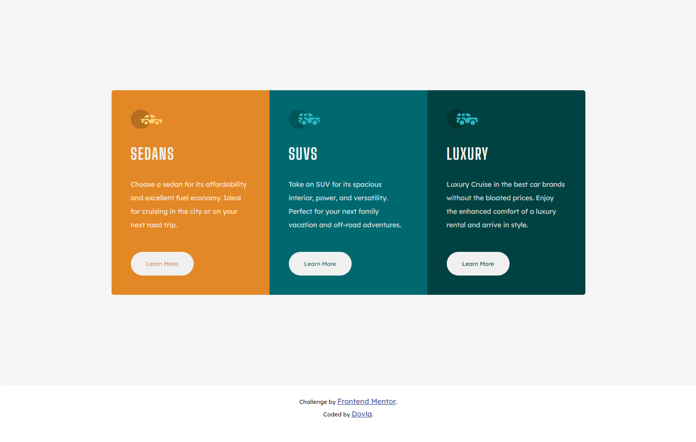

# Frontend Mentor - 3-column preview card component solution

This is a solution to the [3-column preview card component challenge on Frontend Mentor](https://www.frontendmentor.io/challenges/3column-preview-card-component-pH92eAR2-). Frontend Mentor challenges help you improve your coding skills by building realistic projects.

## Table of contents

- [Overview](#overview)
  - [The challenge](#the-challenge)
  - [Screenshot](#screenshot)
  - [Links](#links)
- [My process](#my-process)
  - [Built with](#built-with)
  - [What I learned](#what-i-learned)
- [Author](#author)

## Overview

### The challenge

Users should be able to:

- View the optimal layout depending on their device's screen size
- See hover states for interactive elements

### Screenshot



### Links

- Solution URL: [Add solution URL here](https://your-solution-url.com)
- Live Site URL: [Live Site URL](https://3-column-preview-c4rd.netlify.app)

## My process

### Built with

- Semantic HTML5 markup
- CSS custom properties
- Flexbox
- CSS Grid
- Mobile-first workflow

### What I learned

Finally, I think I figured out the CSS Grid and CSS Flexbox!!! I am so proud! I used CSS Grid for mobile first process because I needed "the grid", and Flexbox for the desktop. I thought that the desktop version is going to be rewriting a lot of the code, but in three simple @media queries I managed to finish the project.

CSS Grid snippet below:

```css
.container {
  display: grid;
  margin-left: auto;
  margin-right: auto;
  justify-items: center;
  max-width: 375px;
  max-height: 1507px;
  padding: 20px;
}
```
CSS Flexbox snippet for the desktop view:

```
@media only screen and (min-width: 1440px) {
  .container {
    display: flex;
    justify-content: center;
    align-items: center;
    min-width: 1440px;
    min-height: 800px;
    padding: 20px;
  }
}
```

## Author

- My Website - [Dovla](https://dovla.me)
- Frontend Mentor - [@D0vl4](https://www.frontendmentor.io/profile/D0vl4)
